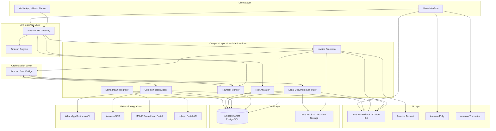

# Design Document: MSME Payment Enforcement System

## Overview

The MSME Payment Enforcement System is a serverless, AI-powered platform built on AWS that automates payment enforcement under the MSMED Act. The system uses a multi-agent architecture orchestrated through AWS Lambda, with Claude 3.5 Sonnet (via Amazon Bedrock) providing intelligent document processing, communication generation, and legal drafting capabilities.

The architecture follows a serverless, event-driven design pattern where each component operates as an independent Lambda function, communicating through Amazon EventBridge and storing state in Amazon Aurora. This ensures scalability, cost-efficiency, and resilience while maintaining compliance with Indian data privacy standards.

### Key Design Principles

1. **Serverless-First**: All compute operations run on AWS Lambda for automatic scaling and cost optimization
2. **Event-Driven**: Components communicate asynchronously through EventBridge for loose coupling
3. **AI-Augmented**: Claude 3.5 Sonnet handles natural language understanding, generation, and legal drafting
4. **Security-First**: End-to-end encryption, secure Udyam/Aadhaar validation, and compliance with Indian data privacy laws
5. **Vernacular-Native**: Multi-language support (Tamil/Hindi/English) at every layer
6. **Offline-Resilient**: Mobile app with local caching and sync capabilities

## Architecture

### High-Level Architecture




### Component Interaction Flow

1. **Invoice Ingestion Flow**: Mobile App → API Gateway → Invoice Processor Lambda → Textract → Bedrock (validation) → S3 (storage) → Aurora (metadata) → EventBridge (invoice.created event)
2. **Payment Monitoring Flow**: EventBridge (scheduled) → Payment Monitor Lambda → Aurora (query overdue invoices) → EventBridge (reminder.due or notice.due events)
3. **Communication Flow**: EventBridge (reminder.due) → Communication Agent Lambda → Bedrock (generate message) → WhatsApp/SES → Aurora (log delivery)
4. **Legal Escalation Flow**: EventBridge (notice.due) → Legal Document Generator Lambda → Bedrock (draft notice) → S3 (store PDF) → Aurora (update status) → API Gateway (notify retailer)
5. **Samadhaan Filing Flow**: Mobile App → API Gateway → Samadhaan Integrator Lambda → Udyam API (validate) → Bedrock (format submission) → Samadhaan Portal API → Aurora (store confirmation)

## Components and Interfaces

### 1. Invoice Processor Lambda

**Responsibility**: Processes uploaded invoices, extracts mandatory fields, and stores invoice records.

**Inputs**:
- Invoice image/PDF from S3 (triggered by S3 event)
- Retailer ID and metadata from API Gateway

**Processing**:
1. Call Amazon Textract to extract text and form data
2. Use Claude 3.5 via Bedrock to identify and validate mandatory fields:
   - Buyer GSTIN (format: 2 digits + 10 alphanumeric + 1 letter + 1 digit + 1 letter + 1 alphanumeric)
   - Udyam Number (format: UDYAM-XX-00-0000000)
   - Invoice Date (various formats, normalized to ISO 8601)
   - Principal Amount (numeric with currency symbol)
3. Calculate confidence scores for each extracted field
4. Store original document in S3 with encryption
5. Store invoice metadata in Aurora
6. Publish "invoice.created" event to EventBridge

**Outputs**:
- Invoice record in Aurora with extracted fields
- Document reference in S3
- EventBridge event for downstream processing

**Error Handling**:
- If confidence < 80% for any field, flag for manual review
- If Textract fails, retry up to 3 times with exponential backoff
- If document is corrupted, return error to user with localized message

**Interface**:
```typescript
interface InvoiceProcessorInput {
  retailerId: string;
  documentS3Key: string;
  documentType: 'image' | 'pdf';
  preferredLanguage: 'ta' | 'hi' | 'en';
}

interface InvoiceProcessorOutput {
  invoiceId: string;
  extractedFields: {
    buyerGSTIN: string;
    udyamNumber: string;
    invoiceDate: string; // ISO 8601
    principalAmount: number;
    confidence: {
      buyerGSTIN: number;
      udyamNumber: number;
      invoiceDate: number;
      principalAmount: number;
    };
  };
  requiresManualReview: boolean;
  reviewFields: string[];
}
```

### 2. Payment Monitor Lambda

**Responsibility**: Continuously monitors payment deadlines and triggers enforcement actions.

**Trigger**: EventBridge scheduled rule (runs every 6 hours)

**Processing**:
1. Query Aurora for all active (unpaid) invoices
2. For each invoice, calculate days since invoice date
3. Determine appropriate action based on days elapsed:
   - Day 30: Publish "reminder.first" event
   - Day 40: Publish "reminder.second" event
   - Day 44: Publish "reminder.final" event
   - Day 46: Publish "notice.generate" event
4. Calculate compound interest penalty for overdue invoices
5. Update invoice status in Aurora

**Outputs**:
- EventBridge events triggering reminders or legal notices
- Updated invoice records with calculated penalties

**Interface**:
```typescript
interface PaymentMonitorEvent {
  eventType: 'reminder.first' | 'reminder.second' | 'reminder.final' | 'notice.generate';
  invoiceId: string;
  retailerId: string;
  buyerGSTIN: string;
  invoiceDate: string;
  principalAmount: number;
  daysElapsed: number;
  compoundInterestPenalty?: number; // Only for overdue invoices
  preferredLanguage: 'ta' | 'hi' | 'en';
}
```

### 3. Communication Agent Lambda

**Responsibility**: Generates and sends diplomatic reminders to buyers via WhatsApp and Email.

**Trigger**: EventBridge events (reminder.first, reminder.second, reminder.final)

**Processing**:
1. Retrieve invoice details from Aurora
2. Use Claude 3.5 via Bedrock to generate contextual, diplomatic message:
   - Prompt includes: reminder stage, invoice details, cultural context, language preference
   - Tone: professional, respectful, escalating urgency
3. Translate message to target language if needed
4. Send via WhatsApp Business API (primary channel)
5. Send via Amazon SES (backup channel)
6. Log delivery status in Aurora
7. Implement retry logic with exponential backoff (max 3 attempts)

**Outputs**:
- Sent messages via WhatsApp and Email
- Delivery logs in Aurora

**Interface**:
```typescript
interface CommunicationAgentInput {
  reminderType: 'first' | 'second' | 'final';
  invoiceId: string;
  buyerContact: {
    phone: string; // For WhatsApp
    email: string;
  };
  invoiceDetails: {
    invoiceNumber: string;
    invoiceDate: string;
    principalAmount: number;
    dueDate: string;
  };
  language: 'ta' | 'hi' | 'en';
}

interface BedrockPromptTemplate {
  systemPrompt: string;
  userPrompt: string;
  temperature: number;
  maxTokens: number;
}
```


### 4. Legal Document Generator Lambda

**Responsibility**: Drafts formal Section 15 notices under the MSMED Act using AI-powered legal language generation.

**Trigger**: EventBridge event (notice.generate)

**Processing**:
1. Retrieve invoice and retailer details from Aurora
2. Calculate final compound interest penalty (3x bank rate, compounded monthly)
3. Use Claude 3.5 via Bedrock to draft Section 15 notice:
   - Prompt includes: legal template, invoice details, penalty calculation, MSMED Act references
   - Ensure formal legal tone and compliance with statutory requirements
4. Generate notice in retailer's preferred language
5. Convert to PDF format
6. Store PDF in S3 with encryption
7. Update invoice status to "legal_notice_generated"
8. Send notification to retailer for approval

**Outputs**:
- PDF document stored in S3
- Invoice status updated in Aurora
- Notification to retailer via API Gateway WebSocket

**Interface**:
```typescript
interface LegalDocumentGeneratorInput {
  invoiceId: string;
  retailerDetails: {
    name: string;
    udyamNumber: string;
    address: string;
    contact: string;
  };
  buyerDetails: {
    name: string;
    gstin: string;
    address: string;
    contact: string;
  };
  invoiceDetails: {
    invoiceNumber: string;
    invoiceDate: string;
    principalAmount: number;
    dueDate: string;
    overdueBy: number; // days
  };
  penaltyCalculation: {
    bankRate: number;
    penaltyRate: number; // 3x bank rate
    compoundInterest: number;
    totalAmountDue: number;
  };
  language: 'ta' | 'hi' | 'en';
}

interface Section15Notice {
  noticeId: string;
  generatedDate: string;
  pdfS3Key: string;
  content: {
    header: string;
    body: string;
    footer: string;
    legalReferences: string[];
  };
}
```

### 5. Risk Analyzer Lambda

**Responsibility**: Calculates buyer reliability scores based on historical payment patterns.

**Trigger**: API Gateway request (on-demand when retailer searches for buyer)

**Processing**:
1. Query Aurora for all historical invoices associated with buyer GSTIN
2. Calculate metrics:
   - Average payment delay (days)
   - On-time payment percentage
   - Number of disputes filed
   - Total transaction volume
3. Use Claude 3.5 via Bedrock to generate risk assessment:
   - Input: aggregated anonymized payment patterns
   - Output: reliability score (0-100) and risk category
4. Cache result in Aurora for 24 hours

**Outputs**:
- Buyer reliability score and risk assessment
- Cached result in Aurora

**Interface**:
```typescript
interface RiskAnalyzerInput {
  buyerGSTIN: string;
}

interface RiskAnalyzerOutput {
  buyerGSTIN: string;
  reliabilityScore: number; // 0-100
  riskCategory: 'low' | 'medium' | 'high';
  metrics: {
    averagePaymentDelay: number; // days
    onTimePaymentPercentage: number;
    disputeCount: number;
    totalTransactionCount: number;
    dataConfidence: 'high' | 'medium' | 'low'; // Based on sample size
  };
  recommendation: string; // Generated by Claude
  lastUpdated: string; // ISO 8601
}
```

### 6. Samadhaan Integrator Lambda

**Responsibility**: Validates Udyam registration and submits pre-filled dispute forms to MSME Samadhaan portal.

**Trigger**: API Gateway request (when retailer initiates dispute filing)

**Processing**:
1. Validate Udyam Number via Udyam Portal API
2. Retrieve invoice, Section 15 notice, and all communication logs from Aurora/S3
3. Use Claude 3.5 via Bedrock to format dispute submission:
   - Map invoice data to Samadhaan form fields
   - Generate case summary and description
4. Attach supporting documents (invoice PDF, Section 15 notice)
5. Submit to MSME Samadhaan portal via API
6. Store submission confirmation and reference number in Aurora

**Outputs**:
- Validated Udyam registration
- Submitted dispute with reference number
- Updated invoice status in Aurora

**Interface**:
```typescript
interface SamaadhaanIntegratorInput {
  invoiceId: string;
  retailerUdyamNumber: string;
}

interface UdyamValidationResponse {
  valid: boolean;
  enterpriseDetails?: {
    name: string;
    type: 'micro' | 'small' | 'medium';
    registrationDate: string;
  };
  error?: string;
}

interface SamaadhaanSubmission {
  referenceNumber: string;
  submissionDate: string;
  status: 'submitted' | 'pending_review' | 'accepted';
  portalUrl: string;
}
```

### 7. Voice Interface Handler Lambda

**Responsibility**: Processes voice commands and provides voice responses for low-literacy users.

**Trigger**: API Gateway request from mobile app

**Processing**:
1. Receive audio stream from mobile app
2. Use Amazon Transcribe to convert speech to text
3. Use Claude 3.5 via Bedrock to interpret intent and extract parameters
4. Route to appropriate Lambda function (Invoice Processor, Payment Monitor, Risk Analyzer)
5. Format response for voice output
6. Use Amazon Polly to convert text response to speech
7. Return audio stream to mobile app

**Outputs**:
- Transcribed text and interpreted intent
- Audio response stream

**Interface**:
```typescript
interface VoiceInterfaceInput {
  audioS3Key: string; // Audio uploaded to S3
  language: 'ta' | 'hi' | 'en';
  retailerId: string;
}

interface VoiceInterfaceOutput {
  transcription: string;
  intent: 'upload_invoice' | 'check_status' | 'search_buyer' | 'unknown';
  parameters: Record<string, any>;
  responseText: string;
  responseAudioS3Key: string;
}
```

## Data Models

### Aurora PostgreSQL Schema

```sql
-- Retailers table
CREATE TABLE retailers (
  retailer_id UUID PRIMARY KEY DEFAULT gen_random_uuid(),
  udyam_number VARCHAR(50) UNIQUE NOT NULL,
  name VARCHAR(255) NOT NULL,
  phone VARCHAR(15) NOT NULL,
  email VARCHAR(255),
  preferred_language VARCHAR(2) NOT NULL CHECK (preferred_language IN ('ta', 'hi', 'en')),
  address TEXT,
  created_at TIMESTAMP DEFAULT CURRENT_TIMESTAMP,
  updated_at TIMESTAMP DEFAULT CURRENT_TIMESTAMP
);

-- Buyers table
CREATE TABLE buyers (
  buyer_id UUID PRIMARY KEY DEFAULT gen_random_uuid(),
  gstin VARCHAR(15) UNIQUE NOT NULL,
  name VARCHAR(255) NOT NULL,
  phone VARCHAR(15),
  email VARCHAR(255),
  address TEXT,
  reliability_score INTEGER CHECK (reliability_score BETWEEN 0 AND 100),
  risk_category VARCHAR(10) CHECK (risk_category IN ('low', 'medium', 'high')),
  score_updated_at TIMESTAMP,
  created_at TIMESTAMP DEFAULT CURRENT_TIMESTAMP
);

-- Invoices table
CREATE TABLE invoices (
  invoice_id UUID PRIMARY KEY DEFAULT gen_random_uuid(),
  retailer_id UUID NOT NULL REFERENCES retailers(retailer_id),
  buyer_id UUID NOT NULL REFERENCES buyers(buyer_id),
  invoice_number VARCHAR(100),
  invoice_date DATE NOT NULL,
  principal_amount DECIMAL(15, 2) NOT NULL,
  due_date DATE NOT NULL, -- invoice_date + 45 days
  payment_date DATE,
  payment_reference VARCHAR(100),
  status VARCHAR(20) NOT NULL CHECK (status IN ('active', 'paid', 'overdue', 'legal_notice_sent', 'dispute_filed')),
  document_s3_key VARCHAR(500) NOT NULL,
  extraction_confidence JSONB, -- Stores confidence scores for each field
  requires_manual_review BOOLEAN DEFAULT FALSE,
  compound_interest_penalty DECIMAL(15, 2),
  total_amount_due DECIMAL(15, 2),
  created_at TIMESTAMP DEFAULT CURRENT_TIMESTAMP,
  updated_at TIMESTAMP DEFAULT CURRENT_TIMESTAMP
);

-- Communications table (audit trail)
CREATE TABLE communications (
  communication_id UUID PRIMARY KEY DEFAULT gen_random_uuid(),
  invoice_id UUID NOT NULL REFERENCES invoices(invoice_id),
  communication_type VARCHAR(20) NOT NULL CHECK (communication_type IN ('reminder_first', 'reminder_second', 'reminder_final', 'legal_notice')),
  channel VARCHAR(10) NOT NULL CHECK (channel IN ('whatsapp', 'email')),
  recipient VARCHAR(255) NOT NULL,
  message_content TEXT NOT NULL,
  delivery_status VARCHAR(20) NOT NULL CHECK (delivery_status IN ('sent', 'delivered', 'failed', 'read')),
  sent_at TIMESTAMP DEFAULT CURRENT_TIMESTAMP,
  delivered_at TIMESTAMP,
  retry_count INTEGER DEFAULT 0
);

-- Legal notices table
CREATE TABLE legal_notices (
  notice_id UUID PRIMARY KEY DEFAULT gen_random_uuid(),
  invoice_id UUID NOT NULL REFERENCES invoices(invoice_id),
  notice_type VARCHAR(20) DEFAULT 'section_15',
  generated_date DATE NOT NULL,
  approved_by_retailer BOOLEAN DEFAULT FALSE,
  approved_at TIMESTAMP,
  sent_at TIMESTAMP,
  pdf_s3_key VARCHAR(500) NOT NULL,
  language VARCHAR(2) NOT NULL,
  created_at TIMESTAMP DEFAULT CURRENT_TIMESTAMP
);

-- Samadhaan submissions table
CREATE TABLE samadhaan_submissions (
  submission_id UUID PRIMARY KEY DEFAULT gen_random_uuid(),
  invoice_id UUID NOT NULL REFERENCES invoices(invoice_id),
  reference_number VARCHAR(100) UNIQUE NOT NULL,
  submission_date DATE NOT NULL,
  status VARCHAR(20) NOT NULL CHECK (status IN ('submitted', 'pending_review', 'accepted', 'hearing_scheduled', 'resolved')),
  portal_url VARCHAR(500),
  resolution_details TEXT,
  created_at TIMESTAMP DEFAULT CURRENT_TIMESTAMP,
  updated_at TIMESTAMP DEFAULT CURRENT_TIMESTAMP
);

-- Audit logs table
CREATE TABLE audit_logs (
  log_id UUID PRIMARY KEY DEFAULT gen_random_uuid(),
  entity_type VARCHAR(50) NOT NULL, -- 'invoice', 'communication', 'notice', etc.
  entity_id UUID NOT NULL,
  action VARCHAR(100) NOT NULL,
  performed_by UUID, -- retailer_id or 'system'
  details JSONB,
  timestamp TIMESTAMP DEFAULT CURRENT_TIMESTAMP
);

-- Indexes for performance
CREATE INDEX idx_invoices_retailer ON invoices(retailer_id);
CREATE INDEX idx_invoices_buyer ON invoices(buyer_id);
CREATE INDEX idx_invoices_status ON invoices(status);
CREATE INDEX idx_invoices_due_date ON invoices(due_date);
CREATE INDEX idx_communications_invoice ON communications(invoice_id);
CREATE INDEX idx_buyers_gstin ON buyers(gstin);
```


### S3 Document Storage Structure

```
msme-payment-enforcement/
├── invoices/
│   ├── {retailer_id}/
│   │   ├── {invoice_id}/
│   │   │   ├── original.{ext}  # Original uploaded document
│   │   │   └── pages/          # Individual pages if multi-page
│   │   │       ├── page_1.jpg
│   │   │       └── page_2.jpg
├── legal_notices/
│   ├── {invoice_id}/
│   │   └── section_15_notice_{timestamp}.pdf
└── voice_recordings/
    ├── {retailer_id}/
    │   ├── input_{timestamp}.mp3
    │   └── response_{timestamp}.mp3
```

All objects stored with:
- Server-side encryption (SSE-S3 or SSE-KMS)
- Lifecycle policy: Transition to Glacier after 1 year, retain for 7 years
- Versioning enabled for legal documents

## Correctness Properties

A property is a characteristic or behavior that should hold true across all valid executions of a system—essentially, a formal statement about what the system should do. Properties serve as the bridge between human-readable specifications and machine-verifiable correctness guarantees.

### Property Reflection

After analyzing all acceptance criteria, I identified several areas where properties can be consolidated:

1. **Reminder timing properties (4.1, 4.2, 4.3)** can be combined into a single comprehensive property about reminder scheduling
2. **Penalty calculation properties (6.1, 6.2, 6.3, 6.4, 6.5)** can be consolidated into properties about calculation correctness and real-time updates
3. **Language selection properties (4.4, 5.5, 9.4, 10.2, 10.3)** share the same underlying behavior and can be unified
4. **Audit logging properties (14.1, 14.2, 14.3, 14.4)** all test that events are logged and can be combined
5. **Offline sync properties (15.2, 15.4)** both test queuing and synchronization behavior

### Core Properties

**Property 1: File Format Validation**
*For any* uploaded document, the Invoice_Processor should accept files with JPEG, PNG, HEIC, or PDF extensions and reject all other formats with an appropriate error message.
**Validates: Requirements 1.1, 1.2**

**Property 2: File Size Validation**
*For any* uploaded PDF document, the Invoice_Processor should accept files up to 10MB and reject larger files with an appropriate error message.
**Validates: Requirements 1.2**

**Property 3: Processing Time Bound**
*For any* valid invoice document, the Invoice_Processor should complete extraction and storage within 30 seconds.
**Validates: Requirements 1.3**

**Property 4: Multi-Page Consolidation**
*For any* set of invoice page images uploaded for the same invoice, the Invoice_Processor should create exactly one invoice record with all pages referenced.
**Validates: Requirements 1.4**

**Property 5: Low Confidence Field Flagging**
*For any* extracted field with confidence score below 80%, the Invoice_Processor should flag that field for manual review and prompt the retailer to verify it.
**Validates: Requirements 2.5**

**Property 6: Extraction Completeness**
*For any* processed invoice, the Invoice_Processor should return all four mandatory fields (Buyer_GSTIN, Udyam_Number, Invoice_Date, Principal_Amount) in the response for retailer confirmation.
**Validates: Requirements 2.6**

**Property 7: Due Date Calculation**
*For any* invoice date, the Payment_Monitor should calculate the due date as exactly 45 days after the invoice date.
**Validates: Requirements 3.1**

**Property 8: Days Remaining Calculation**
*For any* invoice with a due date, the Payment_Monitor should correctly calculate the number of days remaining (or overdue) relative to the current date.
**Validates: Requirements 3.2, 3.5**

**Property 9: Payment Stops Monitoring**
*For any* invoice marked as paid, the Payment_Monitor should not generate any further reminder or notice events for that invoice.
**Validates: Requirements 3.3, 11.2**

**Property 10: Reminder Scheduling**
*For any* active (unpaid) invoice, the Communication_Agent should send reminders at exactly day 30, day 40, and day 44 after the invoice date, and the Legal_Document_Generator should generate a notice after day 45.
**Validates: Requirements 4.1, 4.2, 4.3, 5.1**

**Property 11: Language Consistency**
*For any* retailer with a preferred language setting, all generated communications, documents, UI elements, and voice responses should be in that language (Tamil, Hindi, or English).
**Validates: Requirements 4.4, 5.5, 9.4, 10.2, 10.3**

**Property 12: Required Message Fields**
*For any* generated reminder message, the message content should include the invoice number, principal amount, and payment due date.
**Validates: Requirements 4.6**

**Property 13: Communication Retry Logic**
*For any* failed communication attempt, the Communication_Agent should retry up to 3 times with exponential backoff before marking as permanently failed.
**Validates: Requirements 4.7**

**Property 14: Legal Notice Mandatory Elements**
*For any* generated Section 15 notice, the document should include all mandatory legal elements: retailer details, buyer details, invoice details, MSMED Act references, compound interest penalty calculation, and formal demand for payment.
**Validates: Requirements 5.2**

**Property 15: Notice Includes Penalty**
*For any* generated Section 15 notice, the document should include the calculated compound interest penalty amount.
**Validates: Requirements 5.4**

**Property 16: Notice Approval Required**
*For any* generated Section 15 notice, the notice should not be sent to the buyer until the retailer explicitly approves it.
**Validates: Requirements 5.6**

**Property 17: Approved Notice Delivery**
*For any* Section 15 notice approved by the retailer, the Communication_Agent should send it via registered email with delivery confirmation tracking.
**Validates: Requirements 5.7**

**Property 18: Compound Interest Calculation**
*For any* overdue invoice, the Payment_Monitor should calculate the compound interest penalty as: Principal_Amount × (1 + (3 × bank_rate / 12))^months - Principal_Amount, where months is the number of complete months overdue.
**Validates: Requirements 6.1, 6.2, 6.3**

**Property 19: Total Amount Calculation**
*For any* overdue invoice, the displayed total amount owed should equal the principal amount plus the compound interest penalty.
**Validates: Requirements 6.4**

**Property 20: Real-Time Penalty Updates**
*For any* overdue invoice, querying the penalty amount at different times should reflect the updated calculation based on the current number of overdue days.
**Validates: Requirements 6.5**

**Property 21: Udyam Validation**
*For any* dispute filing attempt, the Samadhaan_Integrator should validate the Udyam number with the government portal before proceeding with form pre-filling.
**Validates: Requirements 7.1**

**Property 22: Dispute Form Pre-filling**
*For any* validated Udyam number, the Samadhaan_Integrator should pre-fill the dispute form with all invoice details including Buyer_GSTIN, Invoice_Date, Principal_Amount, and Compound_Interest_Penalty.
**Validates: Requirements 7.2, 7.3**

**Property 23: Dispute Document Attachment**
*For any* pre-filled dispute form, the Samadhaan_Integrator should attach both the original invoice document and the Section 15 notice.
**Validates: Requirements 7.4**

**Property 24: Dispute Form Review Required**
*For any* pre-filled dispute form, the form should not be submitted to the MSME Samadhaan portal until the retailer reviews and approves it.
**Validates: Requirements 7.5**

**Property 25: Dispute Submission After Approval**
*For any* dispute form approved by the retailer, the Samadhaan_Integrator should submit it to the MSME Samadhaan portal and store the confirmation reference number.
**Validates: Requirements 7.6**

**Property 26: Buyer Score Retrieval**
*For any* valid Buyer_GSTIN, the Risk_Analyzer should return a Buyer_Reliability_Score when queried.
**Validates: Requirements 8.1**

**Property 27: Score Metric Sensitivity**
*For any* buyer, if the average payment delay increases, or the on-time payment percentage decreases, or the dispute count increases, the Buyer_Reliability_Score should decrease (or stay the same, but not increase).
**Validates: Requirements 8.3, 8.4, 8.5**

**Property 28: Score Range Validation**
*For any* calculated Buyer_Reliability_Score, the score should be between 0 and 100 inclusive.
**Validates: Requirements 8.6**

**Property 29: Risk Category Assignment**
*For any* Buyer_Reliability_Score, the Risk_Analyzer should assign exactly one risk category from: Low Risk, Medium Risk, or High Risk.
**Validates: Requirements 8.7**

**Property 30: Voice Language Support**
*For any* voice command in Tamil, Hindi, or English, the Voice_Interface should successfully transcribe and process the command.
**Validates: Requirements 9.1**

**Property 31: Voice Transcription Performance**
*For any* voice command, the Voice_Interface should complete transcription within 3 seconds.
**Validates: Requirements 9.2**

**Property 32: Voice Intent Recognition**
*For any* recognized voice command, the Voice_Interface should identify the correct intent (upload_invoice, check_status, search_buyer) and execute the corresponding action.
**Validates: Requirements 9.3**

**Property 33: Voice Command Coverage**
*For any* voice command requesting invoice upload, status check, or buyer search, the Voice_Interface should recognize and execute the command.
**Validates: Requirements 9.6**

**Property 34: UI Language Update**
*For any* language preference change, all UI elements should immediately update to display in the newly selected language.
**Validates: Requirements 10.4**

**Property 35: Currency Formatting**
*For any* displayed currency amount, the system should format it according to Indian Rupee conventions (₹ symbol, comma separators for thousands/lakhs).
**Validates: Requirements 10.5**

**Property 36: Payment Marking Prompt**
*For any* invoice being marked as paid, the system should prompt for both payment date and payment reference number before completing the operation.
**Validates: Requirements 11.1**

**Property 37: Payment Duration Calculation**
*For any* invoice marked as paid, the system should calculate the actual payment duration as the number of days between invoice date and payment date.
**Validates: Requirements 11.3**

**Property 38: Payment History Update**
*For any* invoice marked as paid, the buyer's payment history should be updated to include this payment record for future reliability score calculations.
**Validates: Requirements 11.4**

**Property 39: Penalty Payment Recording**
*For any* invoice marked as paid after the 45-day deadline, the system should record whether the compound interest penalty was paid along with the principal amount.
**Validates: Requirements 11.5**

**Property 40: Retailer Notification on Reminder Sent**
*For any* reminder sent to a buyer, the system should send a notification to the retailer confirming the reminder was sent.
**Validates: Requirements 12.1**

**Property 41: Notice Generation Notification**
*For any* automatically generated Section 15 notice, the system should notify the retailer and request approval before sending.
**Validates: Requirements 12.2**

**Property 42: Deadline Approaching Alert**
*For any* invoice with a due date exactly 3 days in the future, the system should send an alert to the retailer.
**Validates: Requirements 12.3**

**Property 43: Overdue Alert**
*For any* invoice that becomes overdue (current date > due date), the system should send an alert to the retailer.
**Validates: Requirements 12.4**

**Property 44: Daily Summary Notifications**
*For any* retailer with notifications enabled, the system should send a daily summary of all active invoices and their current status.
**Validates: Requirements 12.5**

**Property 45: Buyer Response Notification**
*For any* response received from a buyer to a reminder or notice, the system should immediately notify the retailer.
**Validates: Requirements 12.6**

**Property 46: Sensitive Data Encryption**
*For any* invoice stored in the database, sensitive fields (Principal_Amount, Buyer_GSTIN) should be encrypted at rest.
**Validates: Requirements 13.1**

**Property 47: Anonymized Risk Analysis**
*For any* Buyer_Reliability_Score calculation, the Risk_Analyzer should use only anonymized payment pattern data without retailer-identifying information.
**Validates: Requirements 13.2**

**Property 48: Authentication Required**
*For any* system access attempt, the system should require successful authentication via mobile OTP or biometric verification before granting access.
**Validates: Requirements 13.3**

**Property 49: Document Encryption**
*For any* invoice document stored in S3, the document should be encrypted at rest using AES-256 or equivalent encryption.
**Validates: Requirements 13.4**

**Property 50: TLS Transport Security**
*For any* external API communication (WhatsApp, Email, Samadhaan, Udyam), the connection should use TLS 1.3 or higher.
**Validates: Requirements 13.5**

**Property 51: Data Anonymization on Deletion**
*For any* retailer data deletion request, the system should anonymize all retailer-identifying information while preserving aggregated payment statistics for buyer reliability scoring.
**Validates: Requirements 13.7**

**Property 52: Communication Audit Logging**
*For any* sent reminder or notice, the system should log the timestamp, recipient, delivery status, and message content in the audit trail.
**Validates: Requirements 14.1**

**Property 53: Notice Timestamping and Signing**
*For any* generated Section 15 notice, the system should store a timestamped copy with a digital signature for legal validity.
**Validates: Requirements 14.2**

**Property 54: Action Audit Logging**
*For any* action taken by a retailer (invoice upload, payment marking, dispute filing), the system should log the action with timestamp and user identification.
**Validates: Requirements 14.3**

**Property 55: Dispute Submission Recording**
*For any* dispute filed with MSME Samadhaan, the system should store the submission confirmation and reference number in the audit trail.
**Validates: Requirements 14.4**

**Property 56: Audit Trail Generation**
*For any* invoice, the system should be able to generate a chronological report of all activities (uploads, reminders, notices, payments, disputes) associated with that invoice.
**Validates: Requirements 14.5**

**Property 57: Offline Image Capture**
*For any* invoice image capture attempt when internet connectivity is unavailable, the system should store the image locally and allow the capture to complete.
**Validates: Requirements 15.1**

**Property 58: Automatic Sync on Reconnection**
*For any* pending offline operations (image uploads, status updates), the system should automatically synchronize them when internet connectivity is restored.
**Validates: Requirements 15.2, 15.4**

**Property 59: Offline Data Access**
*For any* previously synced invoice, the system should display cached invoice information when operating offline.
**Validates: Requirements 15.3**


## Error Handling

### Error Categories and Strategies

**1. External Service Failures**

- **Amazon Textract Failures**: Retry up to 3 times with exponential backoff (1s, 2s, 4s). If all retries fail, flag document for manual review and notify retailer.
- **Amazon Bedrock Throttling**: Implement exponential backoff with jitter. Queue requests if sustained throttling occurs.
- **WhatsApp API Failures**: Retry up to 3 times, then fall back to email-only delivery. Log failure for retailer notification.
- **Email (SES) Failures**: Retry up to 3 times. If permanent failure (invalid email), notify retailer to update buyer contact information.
- **MSME Samadhaan Portal Errors**: Present error message to retailer with option to retry. Store draft submission for later retry.
- **Udyam Portal API Failures**: Retry validation up to 3 times. If validation service is down, allow manual Udyam number entry with warning.

**2. Data Validation Errors**

- **Invalid GSTIN Format**: Reject immediately with clear error message explaining correct format (15 characters, specific pattern).
- **Invalid Udyam Number Format**: Reject with error message and link to Udyam registration portal.
- **Invalid Date Formats**: Attempt to parse multiple common formats. If parsing fails, prompt retailer to manually enter date.
- **Invalid Amount**: Reject non-numeric or negative amounts with clear error message.
- **Missing Mandatory Fields**: Prevent submission and highlight missing fields in UI.

**3. Business Logic Errors**

- **Duplicate Invoice Upload**: Check for existing invoice with same invoice number and buyer GSTIN. Prompt retailer to confirm if intentional.
- **Payment Marked Before Invoice Date**: Reject with error message indicating payment date cannot precede invoice date.
- **Invalid Payment Amount**: Warn if payment amount doesn't match principal + penalty, but allow retailer to proceed.

**4. Authentication and Authorization Errors**

- **Failed OTP Verification**: Allow up to 3 attempts, then lock account for 15 minutes. Provide option to resend OTP.
- **Expired Session**: Redirect to login with message explaining session timeout.
- **Unauthorized Access**: Return 403 error and log security event for monitoring.

**5. Resource Limits**

- **File Too Large**: Reject immediately with error message indicating 10MB limit.
- **Rate Limiting**: Implement per-retailer rate limits (100 requests/minute). Return 429 status with retry-after header.
- **Storage Quota**: Monitor S3 usage per retailer. Warn at 80% of quota, prevent new uploads at 100%.

**6. Network and Connectivity Errors**

- **Offline Mode**: Queue operations locally and sync when connectivity restored. Display clear offline indicator in UI.
- **Timeout Errors**: Set reasonable timeouts (30s for Textract, 10s for Bedrock, 5s for API calls). Retry with backoff on timeout.
- **Partial Upload Failures**: Implement resumable uploads for large files using S3 multipart upload.

### Error Response Format

All API errors follow a consistent JSON structure:

```typescript
interface ErrorResponse {
  error: {
    code: string; // Machine-readable error code
    message: string; // Human-readable message in retailer's language
    details?: Record<string, any>; // Additional context
    retryable: boolean; // Whether client should retry
    retryAfter?: number; // Seconds to wait before retry
  };
  requestId: string; // For support and debugging
  timestamp: string; // ISO 8601
}
```

### Logging and Monitoring

- **CloudWatch Logs**: All Lambda functions log to CloudWatch with structured JSON logging
- **Error Metrics**: Track error rates by type, component, and severity in CloudWatch Metrics
- **Alarms**: Set up alarms for:
  - Error rate > 5% for any Lambda function
  - Textract failures > 10% of requests
  - Bedrock throttling events
  - Failed communications > 20% of attempts
- **Distributed Tracing**: Use AWS X-Ray to trace requests across Lambda functions and external services

## Testing Strategy

### Dual Testing Approach

The system requires both unit testing and property-based testing for comprehensive coverage:

- **Unit tests**: Verify specific examples, edge cases, and error conditions
- **Property tests**: Verify universal properties across all inputs using randomized test data

Both testing approaches are complementary and necessary. Unit tests catch concrete bugs in specific scenarios, while property tests verify general correctness across a wide range of inputs.

### Property-Based Testing Configuration

**Framework Selection**:
- **TypeScript/JavaScript**: Use `fast-check` library for property-based testing
- **Python** (if used for data processing): Use `hypothesis` library

**Test Configuration**:
- Minimum 100 iterations per property test (due to randomization)
- Each property test must reference its design document property
- Tag format: `Feature: msme-payment-enforcement, Property {number}: {property_text}`

**Example Property Test Structure**:

```typescript
import fc from 'fast-check';

describe('Feature: msme-payment-enforcement, Property 7: Due Date Calculation', () => {
  it('should calculate due date as exactly 45 days after invoice date', () => {
    fc.assert(
      fc.property(
        fc.date(), // Generate random invoice dates
        (invoiceDate) => {
          const dueDate = calculateDueDate(invoiceDate);
          const daysDiff = Math.floor(
            (dueDate.getTime() - invoiceDate.getTime()) / (1000 * 60 * 60 * 24)
          );
          return daysDiff === 45;
        }
      ),
      { numRuns: 100 }
    );
  });
});
```

### Unit Testing Strategy

**Focus Areas for Unit Tests**:
1. **Specific Examples**: Test known invoice formats, specific GSTIN patterns, common date formats
2. **Edge Cases**: Empty files, corrupted PDFs, boundary dates (leap years, month-end), zero amounts
3. **Error Conditions**: Invalid formats, missing fields, network failures, authentication failures
4. **Integration Points**: API contracts with external services (mocked), database operations, S3 operations

**Avoid Over-Testing**:
- Don't write exhaustive unit tests for scenarios covered by property tests
- Focus unit tests on concrete examples that demonstrate correct behavior
- Use unit tests for integration testing between components

### Test Coverage by Component

**Invoice Processor Lambda**:
- Unit tests: Specific invoice formats (GST invoice, retail invoice), corrupted files, missing fields
- Property tests: Properties 1-6 (file validation, processing time, multi-page consolidation, extraction completeness)

**Payment Monitor Lambda**:
- Unit tests: Specific date scenarios (month boundaries, leap years), edge case amounts
- Property tests: Properties 7-9, 18-20 (date calculations, monitoring lifecycle, penalty calculations)

**Communication Agent Lambda**:
- Unit tests: Specific message templates, retry scenarios, delivery failures
- Property tests: Properties 10-13 (reminder scheduling, language consistency, required fields, retry logic)

**Legal Document Generator Lambda**:
- Unit tests: Specific legal notice formats, edge case penalties
- Property tests: Properties 14-17 (mandatory elements, penalty inclusion, approval workflow, delivery)

**Risk Analyzer Lambda**:
- Unit tests: Specific buyer scenarios (new buyer, excellent history, poor history)
- Property tests: Properties 26-29 (score retrieval, metric sensitivity, range validation, category assignment)

**Samadhaan Integrator Lambda**:
- Unit tests: Specific Udyam validation scenarios, API failures
- Property tests: Properties 21-25 (validation, form pre-filling, attachments, approval workflow, submission)

**Voice Interface Handler Lambda**:
- Unit tests: Specific voice commands, noise scenarios, unclear speech
- Property tests: Properties 30-33 (language support, transcription performance, intent recognition, command coverage)

**Multi-Language Support**:
- Unit tests: Specific translations for key phrases
- Property tests: Properties 11, 34-35 (language consistency, UI updates, currency formatting)

**Payment Lifecycle**:
- Unit tests: Specific payment scenarios (on-time, late, partial)
- Property tests: Properties 36-39 (payment marking, duration calculation, history updates, penalty recording)

**Notification System**:
- Unit tests: Specific notification scenarios
- Property tests: Properties 40-45 (various notification triggers)

**Security and Privacy**:
- Unit tests: Specific encryption scenarios, authentication flows
- Property tests: Properties 46-51 (encryption, anonymization, authentication, TLS)

**Audit Trail**:
- Unit tests: Specific audit scenarios
- Property tests: Properties 52-56 (logging completeness, timestamping, trail generation)

**Offline Capability**:
- Unit tests: Specific offline scenarios (capture, sync, conflicts)
- Property tests: Properties 57-59 (offline capture, sync, data access)

### Integration Testing

**End-to-End Flows**:
1. Complete invoice lifecycle: Upload → Extract → Monitor → Remind → Notice → Payment
2. Dispute filing flow: Upload → Overdue → Notice → File Dispute → Confirmation
3. Buyer scoring flow: Multiple invoices → Payment patterns → Score calculation → Risk assessment

**External Service Integration**:
- Mock external APIs (Textract, Bedrock, WhatsApp, Samadhaan, Udyam) for integration tests
- Use AWS SAM Local or LocalStack for local Lambda testing
- Implement contract tests to verify API expectations

### Performance Testing

**Load Testing**:
- Simulate 1000 concurrent retailers uploading invoices
- Test Payment Monitor with 10,000 active invoices
- Verify auto-scaling behavior of Lambda functions

**Latency Testing**:
- Measure end-to-end latency for invoice processing (target: < 30s)
- Measure API response times (target: < 500ms for queries, < 3s for voice transcription)
- Test under various network conditions (3G, 4G, WiFi)

### Security Testing

**Penetration Testing**:
- Test authentication bypass attempts
- Test SQL injection and NoSQL injection
- Test unauthorized access to other retailers' data
- Test encryption at rest and in transit

**Compliance Testing**:
- Verify GDPR-like data privacy compliance
- Verify Indian data localization requirements
- Verify audit trail completeness for legal requirements

### Continuous Integration

**CI/CD Pipeline**:
1. Run unit tests on every commit
2. Run property tests (with reduced iterations: 20) on every commit
3. Run full property tests (100 iterations) on pull requests
4. Run integration tests on staging deployment
5. Run security scans (SAST, dependency scanning) on every build

**Test Reporting**:
- Generate coverage reports (target: > 80% line coverage)
- Track property test failure rates
- Monitor test execution time trends

## Deployment Architecture

### AWS Infrastructure

**Compute**:
- AWS Lambda functions (Node.js 20.x runtime for TypeScript)
- Memory allocation: 512MB-2GB depending on function (Textract processing needs more)
- Timeout: 30s for most functions, 60s for invoice processing
- Concurrency limits: Reserved concurrency for critical functions (Payment Monitor, Communication Agent)

**API Layer**:
- Amazon API Gateway (REST API)
- WebSocket API for real-time notifications
- API Gateway request validation for input sanitization
- Usage plans and API keys for rate limiting

**Authentication**:
- Amazon Cognito User Pools for retailer authentication
- MFA enabled (SMS OTP or TOTP)
- Custom authentication flow for biometric verification

**Event Orchestration**:
- Amazon EventBridge for event-driven architecture
- Scheduled rules for Payment Monitor (every 6 hours)
- Event patterns for invoice lifecycle events

**Data Storage**:
- Amazon Aurora PostgreSQL (Serverless v2) for transactional data
- Multi-AZ deployment for high availability
- Automated backups with 7-year retention
- Encryption at rest using AWS KMS

**Object Storage**:
- Amazon S3 for documents and voice recordings
- S3 Intelligent-Tiering for cost optimization
- Lifecycle policies: Glacier after 1 year, retain for 7 years
- Versioning enabled for legal documents

**AI Services**:
- Amazon Bedrock (Claude 3.5 Sonnet) for text generation and analysis
- Amazon Textract for document OCR
- Amazon Transcribe for speech-to-text (Tamil, Hindi, English)
- Amazon Polly for text-to-speech (Tamil, Hindi, English)

**Messaging**:
- Amazon SES for email delivery
- WhatsApp Business API (third-party integration)
- Amazon SNS for push notifications to mobile app

**Monitoring and Logging**:
- Amazon CloudWatch Logs for centralized logging
- Amazon CloudWatch Metrics for performance monitoring
- AWS X-Ray for distributed tracing
- CloudWatch Alarms for alerting

**Security**:
- AWS WAF for API Gateway protection
- AWS Secrets Manager for API keys and credentials
- AWS KMS for encryption key management
- VPC for Aurora database isolation

### Infrastructure as Code

Use AWS CDK (TypeScript) for infrastructure provisioning:

```typescript
// Example CDK stack structure
class MsmePaymentEnforcementStack extends Stack {
  constructor(scope: Construct, id: string, props?: StackProps) {
    super(scope, id, props);

    // Aurora Serverless v2 cluster
    const database = new rds.DatabaseCluster(this, 'Database', {
      engine: rds.DatabaseClusterEngine.auroraPostgres({
        version: rds.AuroraPostgresEngineVersion.VER_15_3,
      }),
      serverlessV2MinCapacity: 0.5,
      serverlessV2MaxCapacity: 2,
      defaultDatabaseName: 'msme_enforcement',
      enableDataApi: true,
    });

    // S3 bucket for documents
    const documentBucket = new s3.Bucket(this, 'DocumentBucket', {
      encryption: s3.BucketEncryption.KMS,
      versioned: true,
      lifecycleRules: [
        {
          transitions: [
            {
              storageClass: s3.StorageClass.GLACIER,
              transitionAfter: Duration.days(365),
            },
          ],
          expiration: Duration.days(2555), // 7 years
        },
      ],
    });

    // Lambda functions
    const invoiceProcessor = new lambda.Function(this, 'InvoiceProcessor', {
      runtime: lambda.Runtime.NODEJS_20_X,
      handler: 'index.handler',
      code: lambda.Code.fromAsset('dist/invoice-processor'),
      timeout: Duration.seconds(60),
      memorySize: 2048,
      environment: {
        DATABASE_SECRET_ARN: database.secret!.secretArn,
        DOCUMENT_BUCKET: documentBucket.bucketName,
      },
    });

    // EventBridge rules
    const paymentMonitorRule = new events.Rule(this, 'PaymentMonitorRule', {
      schedule: events.Schedule.rate(Duration.hours(6)),
    });
    paymentMonitorRule.addTarget(new targets.LambdaFunction(paymentMonitor));

    // API Gateway
    const api = new apigateway.RestApi(this, 'Api', {
      restApiName: 'MSME Payment Enforcement API',
      deployOptions: {
        tracingEnabled: true,
        loggingLevel: apigateway.MethodLoggingLevel.INFO,
      },
    });
  }
}
```

### Deployment Strategy

**Environments**:
1. **Development**: Single-region, minimal resources, no data retention
2. **Staging**: Production-like, synthetic test data, full monitoring
3. **Production**: Multi-AZ, full redundancy, 7-year data retention

**Deployment Process**:
1. Build and test in CI/CD pipeline
2. Deploy to staging environment
3. Run smoke tests and integration tests
4. Manual approval gate
5. Blue-green deployment to production
6. Monitor error rates and rollback if needed

**Rollback Strategy**:
- Lambda function versions and aliases for instant rollback
- Database migrations use forward-compatible changes only
- Feature flags for gradual rollout of new features

### Cost Optimization

**Estimated Monthly Costs** (for 10,000 active retailers, 50,000 invoices/month):

- Lambda: $200-300 (pay per invocation)
- Aurora Serverless v2: $150-250 (scales with load)
- S3: $50-100 (with Intelligent-Tiering)
- Textract: $500-800 (based on page count)
- Bedrock: $300-500 (based on token usage)
- API Gateway: $50-100
- Other services: $100-200

**Total**: ~$1,350-2,250/month

**Cost Optimization Strategies**:
- Use Lambda reserved concurrency only where needed
- Implement caching for buyer reliability scores (24-hour TTL)
- Batch Textract requests where possible
- Use S3 Intelligent-Tiering for automatic cost optimization
- Monitor and optimize Bedrock token usage

## Security and Compliance

### Data Privacy

**Indian Data Localization**:
- All data stored in AWS Asia Pacific (Mumbai) region
- No cross-border data transfer without explicit consent
- Compliance with proposed Indian data protection laws

**PII Protection**:
- Encrypt all PII at rest (AES-256)
- Encrypt all PII in transit (TLS 1.3)
- Anonymize data for analytics and buyer scoring
- Implement data retention policies (7 years for financial records)

**Access Control**:
- Principle of least privilege for all IAM roles
- Multi-factor authentication for all admin access
- Audit logging for all data access

### Compliance Requirements

**MSMED Act Compliance**:
- Accurate calculation of 45-day payment window
- Correct compound interest penalty calculation (3x bank rate)
- Proper legal notice format and content
- Audit trail for all enforcement actions

**Indian Tax Law Compliance**:
- 7-year data retention for financial records
- Proper GSTIN validation and storage
- Audit trail for all transactions

**WhatsApp Business Policy Compliance**:
- Opt-in required for WhatsApp communications
- 24-hour messaging window for non-template messages
- Approved message templates for reminders and notices

### Security Best Practices

**Application Security**:
- Input validation on all API endpoints
- SQL injection prevention (parameterized queries)
- XSS prevention (output encoding)
- CSRF protection (API Gateway request validation)

**Infrastructure Security**:
- VPC isolation for database
- Security groups with minimal required access
- AWS WAF rules for common attack patterns
- Regular security patching of Lambda runtimes

**Monitoring and Incident Response**:
- Real-time alerting for security events
- Automated response to common threats (rate limiting, IP blocking)
- Incident response playbook for data breaches
- Regular security audits and penetration testing

## Future Enhancements

**Phase 2 Features**:
1. **Predictive Analytics**: ML model to predict payment likelihood based on buyer behavior
2. **Bulk Invoice Upload**: Process multiple invoices in a single upload
3. **Payment Gateway Integration**: Allow buyers to pay directly through the platform
4. **Retailer Community**: Forum for retailers to share experiences with buyers
5. **Advanced Reporting**: Analytics dashboard for payment trends and buyer behavior

**Phase 3 Features**:
1. **Multi-Currency Support**: Support for international transactions
2. **Blockchain Integration**: Immutable audit trail using blockchain
3. **AI-Powered Negotiation**: Chatbot to negotiate payment terms with buyers
4. **Credit Line Integration**: Connect retailers with lenders based on receivables
5. **Mobile App Enhancements**: Offline-first architecture, biometric authentication

**Scalability Considerations**:
- Current architecture supports up to 100,000 retailers and 1M invoices/month
- For larger scale, consider:
  - DynamoDB for invoice metadata (better horizontal scaling)
  - Amazon SQS for asynchronous processing
  - ElastiCache for caching buyer scores and invoice data
  - Multi-region deployment for global expansion
